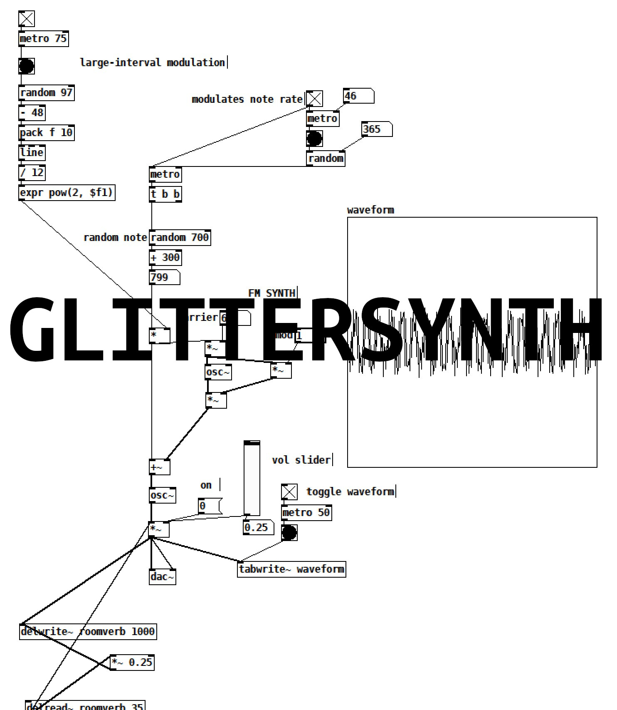

# GlitterSynth-Demo
FM synth with standard modulation and carrier parameters, along with slight envelop control and randomized intervallic jumps. Intended to simulate frequency particles moving in acoustic space like flickers of glitter.

